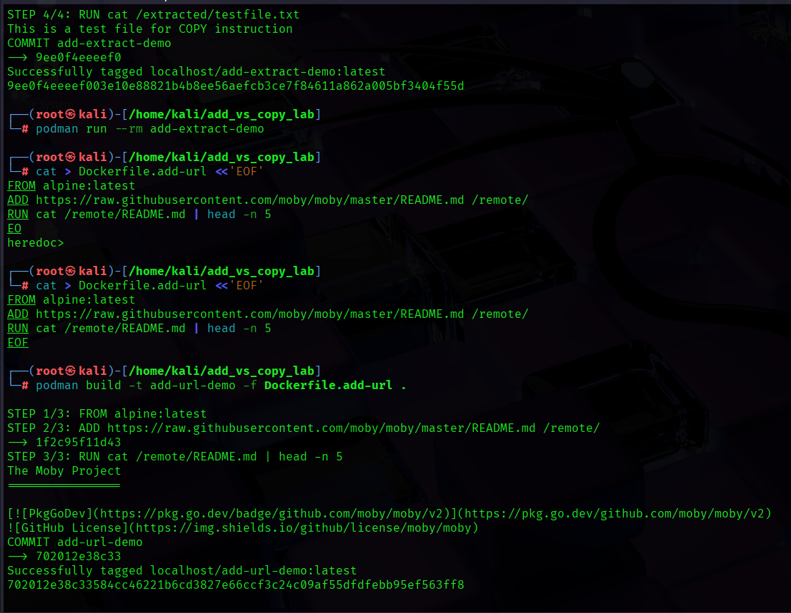

# Lab 3: ADD vs COPY Instruction in Dockerfiles
## 🎯 Objectives

By the end of this lab, you will be able to:

- Understand the differences between ADD and COPY instructions in Dockerfiles

- Learn best practices for choosing ADD vs COPY

- Experiment with ADD’s automatic archive extraction capability

- Test COPY’s predictable file copying behavior

- Explore ADD’s remote URL fetching capability

- Analyze impact of instruction choice on build efficiency and security

## 📌 Prerequisites
- Basic Docker/Podman knowledge

- Podman or Docker installed (Podman recommended)

- Text editor (Vim, Nano, VS Code)

- Internet access for downloading test files

- Basic command line proficiency

---

## ⚙️ Setup Requirements
Install Podman:

```
# RHEL/Fedora/CentOS
sudo dnf install -y podman 
``` 
```
# Debian/Ubuntu
sudo apt-get install -y podman
```
Verify installation:

```
podman --version
```
Create lab directory:

```
mkdir add_vs_copy_lab && cd add_vs_copy_lab
```
---

# 📝 Task 1: Basic COPY Instruction
Create a test file:

```
echo "This is a test file for COPY instruction" > testfile.txt
```
Create Dockerfile.copy:

dockerfile
```
FROM alpine:latest
COPY testfile.txt /destination/
RUN cat /destination/testfile.txt
```
Build and run:

```
podman build -t copy-demo -f Dockerfile.copy .
```
```
podman run --rm copy-demo
```
✅ Expected Outcome: file contents printed.

📌 Key Concept:

- COPY is predictable & safe

- Only copies from build context

- No auto-extraction or URL support

---

# 📝 Task 2: Basic ADD Instruction
Create Dockerfile.add:

dockerfile
```
FROM alpine:latest
ADD testfile.txt /destination/
RUN cat /destination/testfile.txt
```
Build and run:

```
podman build -t add-demo -f Dockerfile.add .
```
```
podman run --rm add-demo
```
✅ Expected Outcome: Same as COPY.

📌 Key Concept: For simple copying, ADD = COPY, but ADD has extra features.

---

# 📝 Task 3: Archive Extraction with ADD
Create an archive:

```
tar -czf archive.tar.gz testfile.txt
```
Create Dockerfile.add-extract:

dockerfile
```
FROM alpine:latest
ADD archive.tar.gz /extracted/
RUN ls -la /extracted/
RUN cat /extracted/testfile.txt
```
Build and run:

```
podman build -t add-extract-demo -f Dockerfile.add-extract .
```
```
podman run --rm add-extract-demo
```
✅ Expected Outcome: archive auto-extracted.

📌 Key Concept: ADD auto-extracts .tar, .gz, .bz2, .xz files → convenient but risky.

---

# 📝 Task 4: Remote URL Fetching with ADD
Create Dockerfile.add-url:

dockerfile
```
FROM alpine:latest
ADD https://raw.githubusercontent.com/moby/moby/master/README.md /remote/
RUN cat /remote/README.md
```
Build and run:

```
podman build -t add-url-demo -f Dockerfile.add-url .
```
```
podman run --rm add-url-demo
```
✅ Expected Outcome: contents of remote file printed.


📌 Key Concept:

- ADD can fetch from URLs

- External dependency risk

- Remote files cached in image

---


# 📝 Task 5: Comparing Build Cache Behavior
Create a file:

```
echo "Version 1" > version.txt
```
Create Dockerfile.cache:

dockerfile
```
FROM alpine:latest
COPY version.txt /app/
RUN cat /app/version.txt
```
Build first version:

```
podman build -t cache-demo -f Dockerfile.cache .
```
Modify file & rebuild:

```
echo "Version 2" > version.txt
```
```
podman build -t cache-demo -f Dockerfile.cache .
```
Repeat same with ADD.


## 📌 Key Concept:

- Cache invalidates if source file changes

- With URLs, ADD re-downloads if cache breaks

# 📝 Task 6: Security Implications
Simulate malicious archive:

```
echo "malicious content" > badfile
tar -czf bad.tar.gz badfile
```
Create Dockerfile.security:

dockerfile
```
FROM alpine:latest
ADD bad.tar.gz /malicious/
RUN find /malicious -type f
```
Build & run:

```
podman build -t security-demo -f Dockerfile.security .
```
---

## 📌 Key Concept:

- ADD auto-extract can be dangerous with untrusted files

- COPY is safer & recommended unless extra features are needed


## 🛠️ Troubleshooting Tips
- Permission issues → try sudo setenforce 0 (disable SELinux temporarily)

- Cache issues → force rebuild:

```
podman build --no-cache -t imagename .
```
URL fetch fails → check network / use RUN wget or curl for more control

---

# ✅ Conclusion
In this lab, you:

- Learned differences between ADD and COPY

- Used ADD for archives & remote URLs

- Saw cache behavior & security concerns

📌 Best Practice: Use COPY unless you specifically need ADD.

---

## 🚀 Final Verification
List images:

```
podman images
```
✅ You should see: copy-demo, add-demo, add-extract-demo, add-url-demo, cache-demo, security-demo.

## Cleanup:
```
podman rmi copy-demo add-demo add-extract-demo add-url-demo cache-demo security-demo
rm -f testfile.txt archive.tar.gz badfile bad.tar.gz version.txt
```
---

 # Hands-On Expected Output:


---


---



---


---


