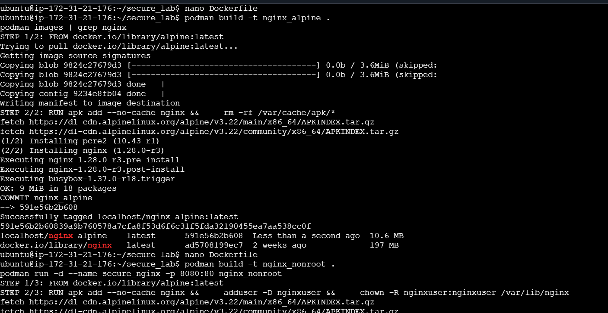

# Lab 5: Securing Images with Least Privilege
## 🎯 Objectives
By the end of this lab, you will be able to:

- Apply security best practices using the principle of least privilege

- Implement image provenance to verify image authenticity

- Perform cache cleanup to reduce attack surface

- Scan container images for vulnerabilities using Podman

- Create and run containers with minimal base images and non-root users

## 📌 Prerequisites
- Linux system with Podman installed (v3.0+)

- Basic understanding of container concepts

- Internet access to pull container images

- sudo privileges for system configuration

---

## ⚙️ Lab Setup
Verify Podman installation:

```
podman --version
```
✅ Expected Output: version number (e.g., 3.4.4)

Create a working directory:

```
mkdir secure_lab && cd secure_lab
```
---

# 📝 Task 1: Scan Images for Vulnerabilities
## 🔹 Subtask 1.1: Pull a Sample Image
```
podman pull docker.io/library/nginx:latest
```
## 🔹 Subtask 1.2: Scan the Image
```
podman scan nginx:latest
```
✅ Expected Output: Vulnerability report showing CVEs + severity

## 🔹 Subtask 1.3: Interpret Results
Look for:

- Critical vulnerabilities (CVSS ≥ 9.0)

- High vulnerabilities (7.0–8.9)

- Affected packages and versions

---

# 📝 Task 2: Remove Package Caches
## 🔹 Subtask 2.1: Create Optimized Dockerfile
dockerfile
```
FROM docker.io/library/nginx:latest

# Remove package caches
RUN rm -rf /var/cache/apt/* /var/lib/apt/lists/*
```
## 🔹 Subtask 2.2: Build Image
```
podman build -t nginx_clean .
```
## 🔹 Subtask 2.3: Verify Size
```
podman images
```
✅ Expected: new image (nginx_clean) is slightly smaller

---

# 📝 Task 3: Use Minimal Base Images
## 🔹 Subtask 3.1: Alpine-based Dockerfile
dockerfile
```
FROM docker.io/library/alpine:latest

RUN apk add --no-cache nginx && \
    rm -rf /var/cache/apk/*
```
## 🔹 Subtask 3.2: Build & Compare
```
podman build -t nginx_alpine .
```
```
podman images | grep nginx
```
✅ Expected: Alpine image is much smaller than Debian/Ubuntu

---

# 📝 Task 4: Run Container as Non-Root
## 🔹 Subtask 4.1: Secure Dockerfile
dockerfile
```
FROM docker.io/library/alpine:latest

RUN apk add --no-cache nginx && \
    adduser -D nginxuser && \
    chown -R nginxuser:nginxuser /var/lib/nginx

USER nginxuser
```
## 🔹 Subtask 4.2: Build & Run
```
podman build -t nginx_nonroot .
```
```
podman run -d --name secure_nginx -p 8080:80 nginx_nonroot
```
## 🔹 Subtask 4.3: Check Processes
```
podman exec secure_nginx ps aux
```
✅ Expected: Nginx processes run as nginxuser (not root)

---

# 📝 Task 5: Implement Image Provenance
## 🔹 Subtask 5.1: Sign the Image
```
podman image sign --sign-by your@email.com nginx_nonroot
```
## 🔹 Subtask 5.2: Verify Signature
```
podman image trust show
```
✅ Expected: Signed image listed in trust store

---

## 🧹 Cleanup
```
podman stop secure_nginx
podman rm secure_nginx
podman rmi nginx nginx_clean nginx_alpine nginx_nonroot
```
---

# ✅ Conclusion
In this lab, you:

- Scanned images for vulnerabilities with Podman

- Reduced attack surface by cleaning caches

- Used minimal base images (Alpine)

- Enforced least privilege by running as non-root

- Applied image provenance via signing

---

## 📌 Best Practices:

- Always clean up caches in images

- Prefer small/minimal base images

- Never run containers as root

- Sign & verify images for provenance

---

## 🚀 Next Steps
- Explore Podman’s --security-opt flags

- Implement SELinux policies for containers

- Automate image scanning in CI/CD pipelines

---

 # Hands-On Expected Output:


---


---


---



---


