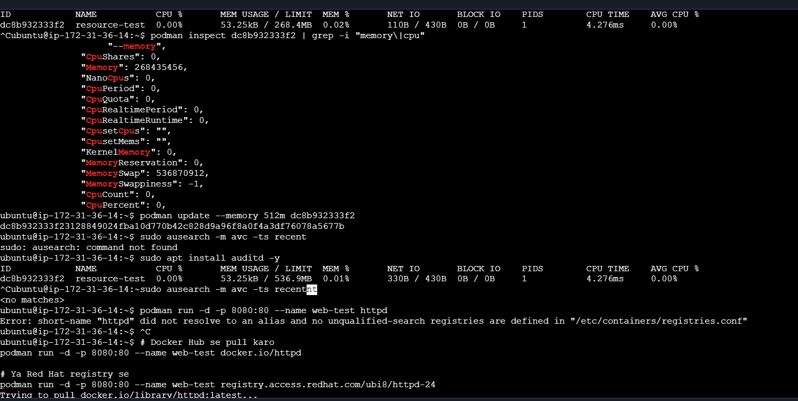
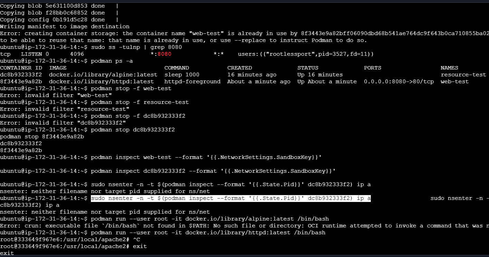
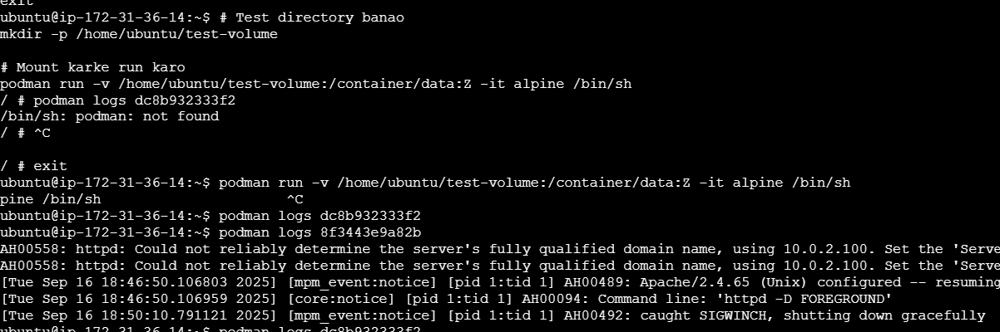

# Lab 19: Troubleshooting Common Container Issues

## Objectives
By the end of this lab, you will be able to:

- Diagnose container resource constraints (CPU, memory).

- Identify and resolve SELinux denials.

- Troubleshoot network conflicts (port binding, namespace issues).

- Fix permission-related problems in containers.

## Prerequisites
- A Linux system with Podman installed (sudo dnf install podman).

- Basic familiarity with Linux commands and container concepts.

- Root or sudo access for SELinux and system-level changes.

---

# Task 1: Diagnose Resource Constraints
## Subtask 1.1: Inspect Container Resource Limits
List running containers:

```
podman ps
```
Outcome: Displays running containers with their IDs/names.

Inspect resource limits:

```
podman inspect <container_id> | grep -i "memory\|cpu"
```
Outcome: Shows CPU/memory limits. If none are set, defaults apply.

Check system resource usage:

```
podman stats <container_id>
```
Outcome: Live view of CPU/memory/disk usage.

## Subtask 1.2: Adjust Resource Limits
Update memory limit (e.g., 512MB):

```
podman update --memory 512m <container_id>
```
Troubleshooting: If the container crashes, increase the limit or check application logs.

---

# Task 2: Resolve SELinux Denials
## Subtask 2.1: Check SELinux Denials
View SELinux audit logs:

```
sudo ausearch -m avc -ts recent
```
Outcome: Lists recent denials. Look for container_t in logs.

Temporarily set SELinux to permissive (for debugging only):

```
sudo setenforce 0
```
⚠️ Warning: Revert with sudo setenforce 1 after testing.

## Subtask 2.2: Fix SELinux Labels
Relabel a volume:

```
sudo chcon -Rt container_file_t /path/to/volume
```
Explanation: Applies the container_file_t context to the volume.

---

# Task 3: Debug Network Conflicts
## Subtask 3.1: Check Port Conflicts
List used ports:

```
sudo ss -tulnp | grep <port_number>
```
Outcome: Identifies if another process is using the port.

Force stop conflicting container:

```
podman stop -f <conflicting_container_id>
```
## Subtask 3.2: Inspect Network Namespace
List container’s network namespace:

```
podman inspect <container_id> --format '{{.NetworkSettings.SandboxKey}}'
```
Outcome: Path to the network namespace (e.g., /run/netns/<id>).

Debug with nsenter:
```
sudo nsenter -n -t $(podman inspect --format '{{.State.Pid}}' <container_id>) ip a
```
Outcome: Shows network interfaces inside the container.

---

# Task 4: Fix Permission Issues
##  Subtask 4.1: Check Container User
Inspect container user:

```
podman inspect <container_id> --format '{{.Config.User}}'
```
Outcome: Displays the user (e.g., root or custom UID).

Run as root (if permissions are denied):

```
podman run --user root -it <image> /bin/bash
```
## Subtask 4.2: Fix Volume Permissions
Match host UID/GID with SELinux relabel:

```
podman run -v /host/path:/container/path:Z -it <image> /bin/bash
```
Explanation: :Z relabels the volume for SELinux.

---

# ✅ Conclusion
In this lab, you learned how to:

- Diagnose CPU/memory constraints using podman inspect and podman stats.

- Resolve SELinux denials via audit logs and chcon.

- Troubleshoot network issues with ss and nsenter.

- Fix permission problems by adjusting users and volume labels.

✅ Final Check:

```
podman logs <container_id>
```
Verify that all issues are resolved.

---

## Additional Resources
- [Podman Documentation](https://docs.podman.io/en/latest/)

- [SELinux Troubleshooting Guide](https://access.redhat.com/articles/2191331)

---

# Hands-On Expected Output:



---



---


